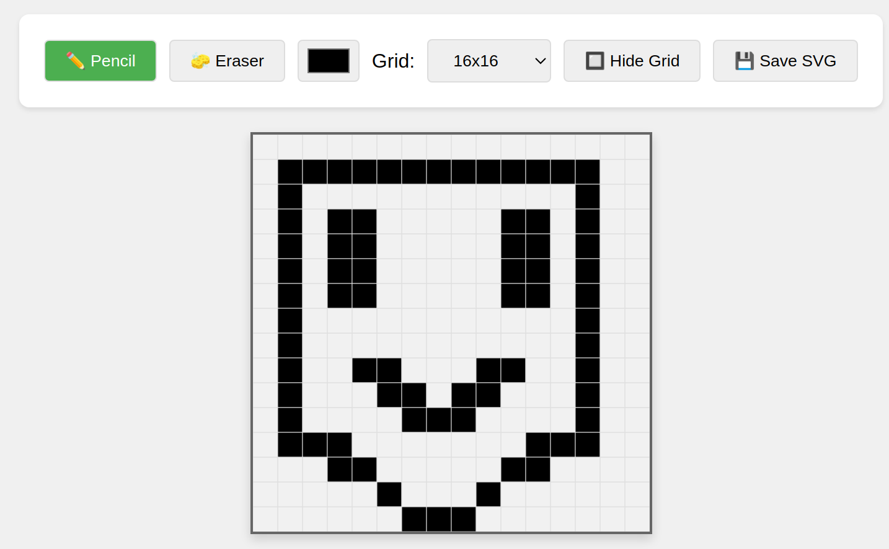

# SVG Pixel Editor

A lightweight, browser-based pixel art editor that allows you to create and export SVG images. Perfect for creating pixel art, icons, or small graphics.
https://therealsmeddy.github.io/svg-pixel-editor/

---

## Features

- **Grid-Based Editing**:
  - Choose from preset grid sizes (16x16, 32x32, 64x64) or set a custom size.
  - Toggle grid visibility for a clean editing experience.

- **Tools**:
  - **Pencil**: Draw with the selected color.
  - **Eraser**: Remove drawings by setting cells back to white.
  - **Color Picker**: Choose any color for drawing.

- **Cell Highlighting**:
  - Hover over cells to see a highlighted border for better precision.

- **Export**:
  - Save your artwork as an SVG file with a single click.
  - Output is clean and free of grid lines or gaps.

- **Customizable**:
  - Adjust grid size and colors to suit your needs.
  - Works entirely in the browser—no server required.

---

## How to Use

1. **Open the Editor**:
   - Simply open the `index.html` file in your browser.

2. **Choose a Grid Size**:
   - Select a grid size from the dropdown or enter a custom size.

3. **Draw**:
   - Use the **Pencil** tool to draw with the selected color.
   - Use the **Eraser** tool to remove drawings.

4. **Toggle Grid**:
   - Click the "Hide Grid" button to hide or show the grid lines.

5. **Save Your Artwork**:
   - Click the "Save SVG" button to download your artwork as an SVG file.

---

## Customization

### Grid Size
- Choose from preset sizes (16x16, 32x32, 64x64) or enter a custom size between 8 and 128.

### Tools
- Switch between the **Pencil** and **Eraser** tools using the buttons.
- Click the color preview box to open the color picker.

### Styling
- Modify the `style` section in the `index.html` file to change the appearance of the editor.

---

## Browser Compatibility

The editor works in all modern browsers, including:
- Google Chrome
- Mozilla Firefox
- Microsoft Edge
- Safari

---

## License

This project is open-source and available under the [MIT License](LICENSE).

---
